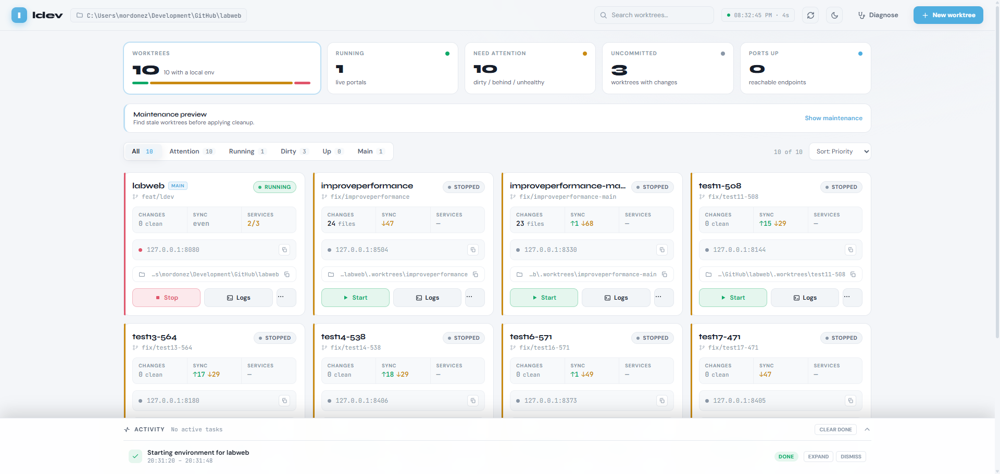

<p align="center">
  
</p>

# ldev

[](https://www.npmjs.com/package/@mordonezdev/ldev)
[-brightgreen)](https://nodejs.org)
[](LICENSE)

**Liferay, scriptable.**

`ldev` turns the Liferay operations that today only live in the admin UI into CLI commands with structured output — for your terminal, your CI pipelines, and your AI agents.

```bash
npm install -g @mordonezdev/ldev
```

---

## What ldev does

| Area | What you can do |
|---|---|
| **Local environments** | Scaffold a Docker-based Liferay runtime from zero. Stand it up, stop it, inspect it. |
| **Branch isolation** | Give each Git branch its own Postgres, Liferay, and OSGi state. Swap branches without rebuilding. |
| **Resource workflows** | Export and import structures, templates, ADTs, and fragments as reviewable files. Preview before applying. |
| **Structure migration** | Migrate journal articles when a content structure changes — a workflow Liferay itself does not have. |
| **Portal inspection** | Discover sites, pages, structures, templates, and where each resource is used, in a single command. |
| **Deploy** | Deploy OSGi modules, client extensions, and WAR files to a running local instance. |
| **OAuth in one step** | Install the OAuth app, verify the token, and write credentials locally without clicking. |
| **Diagnostics** | Group exceptions from recent logs, run environment readiness checks, inspect OSGi bundles. |
| **Dashboard** | A local browser UI that surfaces environment state and drives the same workflows. |
| **Agent workflows** | Structured JSON everywhere, installed skills, and project bootstrap — so an agent can run the same workflows you run. |

---

## The problem ldev solves

Working with Liferay still means doing a lot of work by hand:

- importing and exporting structures, templates, ADTs, and fragments lives in the admin UI
- there is no native pipeline for migrating articles when a structure changes
- standing up a clean local environment from a Liferay Cloud (LCP) backup is a manual sequence
- the Headless API surface is wide but uneven; some operations exist only as legacy JSONWS, some only in the UI
- AI agents cannot click — so without a CLI, they cannot really operate Liferay

`ldev` fills those gaps. It is a focused CLI for the Liferay work that Liferay itself does not expose cleanly as commands or APIs.

## A systems problem, not an AI problem

The same friction that slows a developer — UI-only operations, shared mutable runtimes, no migration path, human-readable output — is also what stops an AI agent from doing real work on Liferay. Different consumer, same wall.

`ldev` cleans up that surface with classic developer-experience moves: reproducible environments, isolated runtimes per branch, guardrails before mutation, operations as data, and structured output everywhere. Each of those is worth doing for humans on its own. The agent integration is a consequence of having done them, not a separate product.

That is why the agent integration is a consequence of having done them, not a separate product — structured output and installed skills are enough.

For the long version, see [Why ldev Exists](https://mordonez.github.io/ldev/core-concepts/why-ldev-exists).

---

## Feature overview

### Resource ops as files

`resource export-*` and `import-*` with `--check-only` previews and read-after-write verification, for structures, templates, ADTs, and fragments. UI-only operations turned into reviewable files.

```bash
ldev resource export-structure --site /global --structure BASIC --file BASIC.json
ldev resource import-structure --site /global --structure BASIC --check-only
ldev resource import-structure --site /global --structure BASIC
```

### Structure migration

`resource migration-init` + `migration-pipeline` — the workflow Liferay does not have for migrating articles when a journal structure changes. Define the migration, run the pipeline, verify the result.

```bash
ldev resource migration-init --site /global --structure BASIC
ldev resource migration-pipeline --file migration.json --check-only
ldev resource migration-pipeline --file migration.json
```

### Portal inventory and where-used

One-pass discovery of sites, pages, structures, templates, and — critically — which pages and articles use a given resource. Useful for audits, impact analysis before a migration, and agent context.

```bash
ldev portal inventory sites
ldev portal inventory structures --site /global
ldev portal inventory where-used --site /global --structure BASIC
```

`where-used` traces every page, display page, fragment, and journal article that references a structure or template. Run it before a migration to know exactly what will be affected.

### Branch-isolated runtimes

`worktree setup --with-env` gives each Git branch its own Postgres, Liferay, and OSGi state. On Linux + Btrfs, snapshots make branch swaps near-instant.

```bash
ldev worktree setup my-feature --with-env
ldev worktree list
ldev worktree status my-feature
```

### Deploy

Deploy OSGi modules, client extensions, and WAR files to a running local instance and watch the OSGi state settle.

```bash
ldev deploy module build/libs/my-module.jar
ldev deploy client-extension build/client-extension.zip
ldev deploy war build/my-portlet.war
```

### OAuth in one command

`oauth install --write-env` deploys the installer bundle, creates the OAuth application via Gogo Shell, verifies the token, and writes credentials to the local environment file.

```bash
ldev oauth install --write-env
```

### Local environments from zero

`project init` + `start` scaffold a working Docker-based Liferay runtime without manual Compose plumbing. `setup` is optional — use it to pre-pull images before the first `start`.

```bash
ldev project init ~/projects/my-project
cd ~/projects/my-project
ldev start --activation-key-file /path/to/activation-key.xml
ldev oauth install --write-env
```

---

## Dashboard

`ldev dashboard` gives you a local control surface for the operational loop: worktree inventory, runtime actions (start, stop, restart, deploy status), recent commits, changed files, maintenance preview, live task activity, and guided flows for DB tools, log diagnostics, and resource exports.

```bash
ldev dashboard
ldev dashboard --port 4242 --no-open
```

<p align="center">
  
</p>

The dashboard surfaces the same `understand → diagnose → fix → verify` model as the CLI, in a faster local UI for day-to-day worktree and environment operations.

---

## Output you can pipe

Every command that returns data supports `--json` (and `--ndjson` for streaming). Same shape for humans, scripts, and agents:

```bash
ldev portal inventory sites --json
```

```json
[
  {
    "groupId": 20120,
    "siteFriendlyUrl": "/global",
    "name": "Global",
    "pagesCommand": "inventory pages --site /global"
  }
]
```

Errors normalise to a stable envelope, so `jq` plus `--strict` is enough to fail a CI pipeline on a regression. See [Structured Output](https://mordonez.github.io/ldev/core-concepts/structured-output) for the full contract.

---

## Agent workflows

Without a CLI like this, an AI agent cannot meaningfully operate Liferay — too much of the platform lives behind the admin UI. With `ldev`, an agent can stand up an environment, import a structure, run a migration check, deploy a module, and verify the result.

The integration is CLI-first: structured `--json` output everywhere, plus installed skills that teach an agent the correct workflow for each task.

```bash
# Install skills — the agent knows how to use ldev:
npx skills add https://github.com/mordonez/ldev

# Optional: commit agent entrypoint files to your project repo:
ldev ai install --target .
```

---

## Quick install

```bash
npm install -g @mordonezdev/ldev
ldev --help
```

To try without installing globally:

```bash
npx @mordonezdev/ldev --help
```

**Requirements:** Node.js 22+ (24 recommended), Docker + `docker compose`, Git.
For LCP-backed flows: [LCP CLI](https://learn.liferay.com/w/dxp/cloud/reference/command-line-tool).

### Use on an existing Liferay Workspace

Run `ldev` from the workspace root — it detects Blade workspaces and adapts automatically.

### Query a remote portal without a local repo

Set three environment variables and run from any directory:

```bash
export LIFERAY_CLI_URL=https://remote.portal.com
export LIFERAY_CLI_OAUTH2_CLIENT_ID=<client-id>
export LIFERAY_CLI_OAUTH2_CLIENT_SECRET=<client-secret>

ldev portal inventory sites
ldev resource structure --site /global --structure BASIC
ldev resource export-structure --site /global --structure BASIC --file /tmp/BASIC.json
```

---

## Who it is for

- **Liferay developers** who want to script the parts of the platform that today require clicks.
- **Support and ops teams** who need fast, repeatable inspection of running portals.
- **Consultants and architects** who audit customer portals and need structured, reproducible evidence.
- **Teams running AI agents** that need a real execution layer on top of Liferay.

---

## Honest limits

- `ldev db sync` works against **Liferay Cloud (LCP)**. For self-hosted, use `ldev db import --file <backup>` with a backup you already have.
- `ldev logs diagnose` groups exceptions and applies a small set of keyword rules — it speeds up triage, it does not do root-cause analysis.
- Btrfs snapshots for worktrees are Linux-only. macOS and Windows fall back to full directory clones.

---

## Documentation

Full docs: **[mordonez.github.io/ldev](https://mordonez.github.io/ldev/)**

- [What is ldev](https://mordonez.github.io/ldev/getting-started/what-is-ldev)
- [Quickstart](https://mordonez.github.io/ldev/getting-started/quickstart)
- [Resource workflows](https://mordonez.github.io/ldev/workflows/export-import-resources)
- [Dashboard workflow](https://mordonez.github.io/ldev/workflows/dashboard)
- [Structure migration](https://mordonez.github.io/ldev/workflows/resource-migration-pipeline)
- [Worktrees](https://mordonez.github.io/ldev/advanced/worktrees)
- [Agent workflows](https://mordonez.github.io/ldev/agentic/)
- [Command reference](https://mordonez.github.io/ldev/commands/)

## Contributing

```bash
git clone git@github.com:mordonez/ldev.git
cd ldev
npm install
npm run build:watch
npm link
```

See [CONTRIBUTING.md](CONTRIBUTING.md) for conventions and test taxonomy.

## License

Released under the [Apache-2.0 License](LICENSE).
